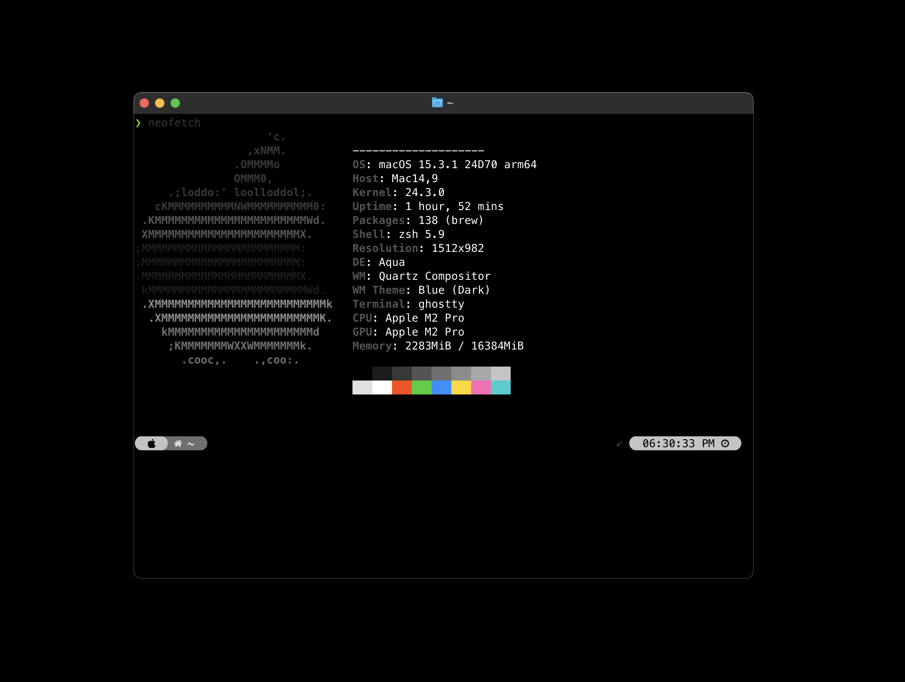

# studio1804 ghostty-theme



A sleek, **monochrome-inspired** theme for [Ghostty](https://github.com/ghostty-org/ghostty)

## Install Theme

Make the script executable

```bash
chmod +x install_theme.sh
```

Run the script to install or update themes

```bash
./install_theme.sh
```

This will:

- Copy all .conf theme files from the themes/ directory into ~/.config/ghostty/themes
- List all installed themes after installation

## Manually Install the theme files

If you prefer to manually install the theme instead of running the script, follow these steps:

1. Copy the .conf file from the themes/ directory to your Ghostty themes configuration folder:

```bash
mkdir -p ~/.config/ghostty/themes
cp themes/studio1804-monochrome.conf ~/.config/ghostty/themes/
```

## Set Theme in config

```text
theme = studio1804-monochrome.conf
```
